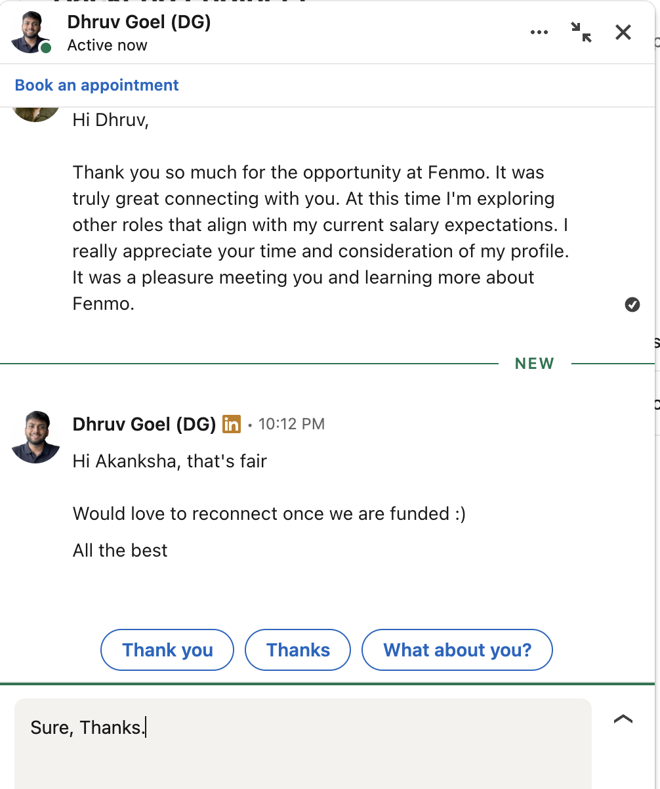
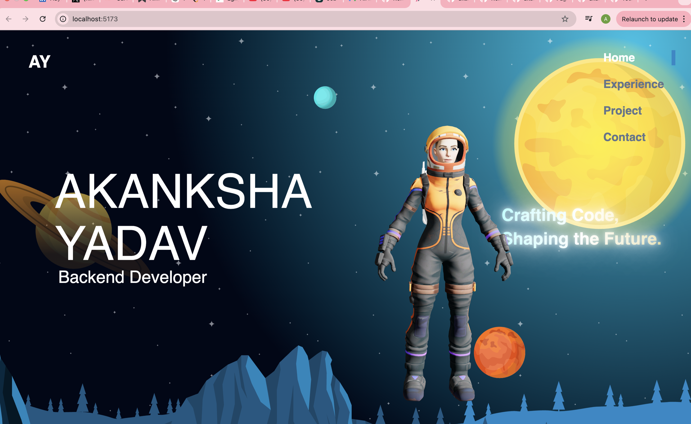
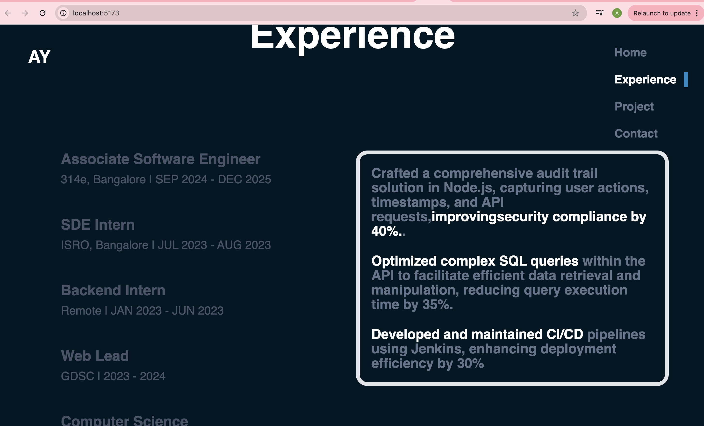
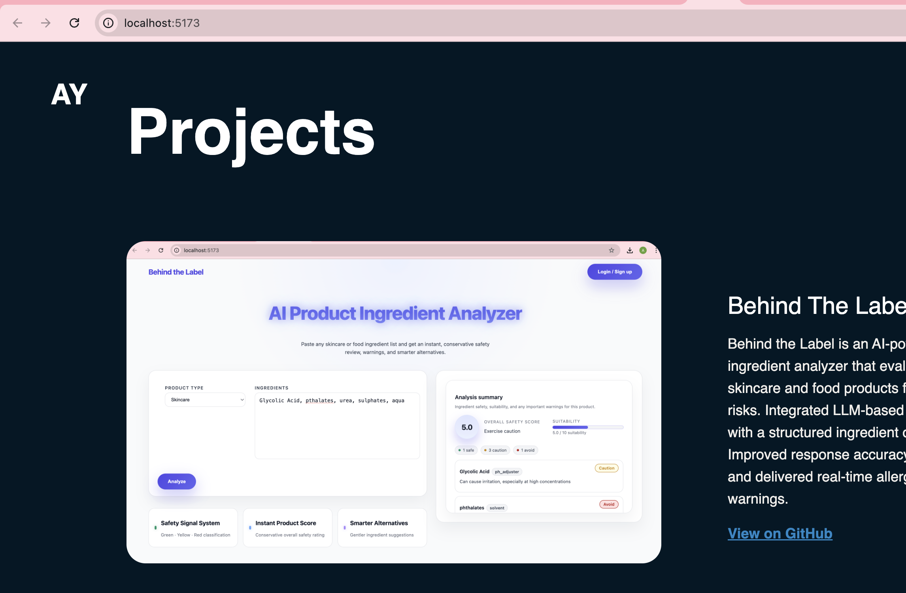
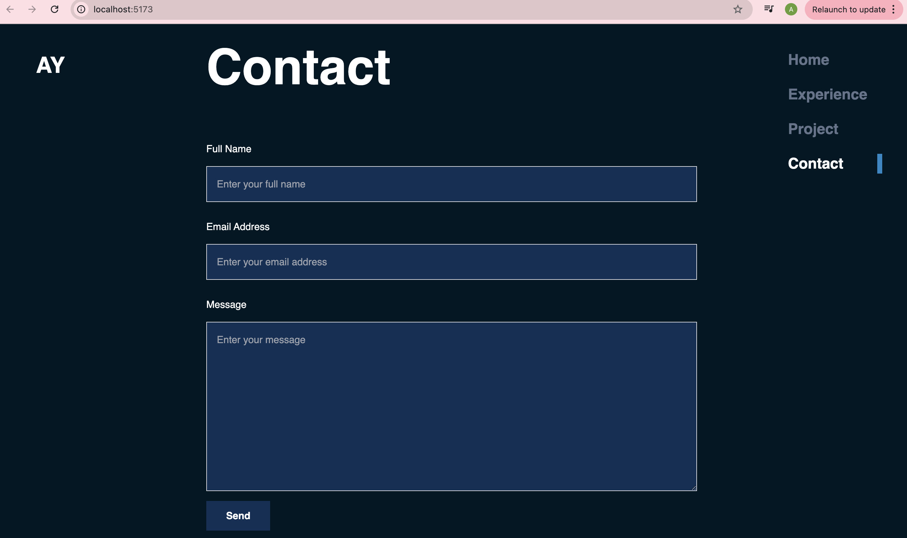

# 3D Portfolio – Akanksha Yadav

An interactive 3D developer portfolio built with React, Vite, Tailwind CSS, and @react-three/fiber.  
It showcases experience, projects, and a contact form with smooth animations and a floating 3D spaceman.

> Note: Image placeholders (`port1`–`port6`) are left in this README so you can easily attach screenshots later.

---

## 🚀 Features

- 3D spaceman model rendered with **@react-three/fiber** and **@react-three/drei**
- Parallax hero section with layered background assets
- Animated **Experience** timeline/cards with detailed bullet points
- **Projects** section with:
  - Project descriptions
  - Images from the `assets` folder
  - GitHub links for each project
- Responsive **Contact** form powered by **Getform**
- Smooth scroll and section highlighting in the navbar using `IntersectionObserver`
- Fully responsive layout with Tailwind CSS

---

## 🖼️ Screenshots (placeholders)

Add your screenshots into `src/assets` as `port1.png`, `port2.png`, etc.,  
then update the paths below (or just change the filenames if you keep them as-is).

```md
 <!-- Hero section -->
 <!-- Experience section -->
 <!-- Projects section -->
 <!-- Project detail -->
 <!-- Contact section -->
 <!-- Mobile view / alternate view -->
```

You can also add captions like:

```md


```

---

## 🧱 Tech Stack

- **Frontend Framework:** React 18 + Vite
- **3D & Graphics:** @react-three/fiber, @react-three/drei, three
- **Styling:** Tailwind CSS, custom CSS animations
- **Routing:** react-router-dom
- **Animations:** framer-motion, GSAP
- **Forms:** Getform (via HTML form `action`)

---

## 📂 Project Structure (high level)

```text
Portfolio_3D/
├─ src/
│  ├─ assets/          # Images, 3D models, icons
│  ├─ components/      # React components (Hero, Experience, Portfolio, Contact, Navbar, etc.)
│  ├─ data/            # Experience and project data (including GitHub links)
│  ├─ hoc/             # Higher-order components (SectionWrapper)
│  ├─ utils/           # Motion variants and utilities
│  ├─ styles.js        # Shared style constants
│  └─ main.jsx         # App entry point
└─ package.json
```

Key components:

- `Hero` – Parallax hero with name, rotating position text, and 3D spaceman
- `Experience` – Clickable experience cards with detailed descriptions
- `Portfolio` – Project cards with images and GitHub links
- `Contact` – Contact form posting to Getform
- `Navbar` – Sticky navbar with section highlighting

---

## ▶️ Getting Started

### 1. Clone the repository

```bash
git clone https://github.com/your-username/3d-portfolio.git
cd 3d-portfolio
```

### 2. Install dependencies

```bash
npm install
```

### 3. Run the development server

```bash
npm run dev
```

Open the URL shown in the terminal (usually `http://localhost:5173`).

### 4. Build for production

```bash
npm run build
```

To preview the production build:

```bash
npm run preview
```

---

## 🧩 Customization

### Update Experiences

Edit the experiences in:  
`src/data/index.js`

```js
const experiences = [
  {
    title: "Associate Software Engineer",
    company_name: "314e, Bangalore",
    date: "SEP 2024 - DEC 2025",
    details: [
      // HTML-enabled bullet points
    ],
  },
  // ...
];
```

The `details` entries support HTML (e.g., `<span>` tags) and are rendered using `dangerouslySetInnerHTML`.

### Update Projects & GitHub Links

In the same file, update your projects:

```js
const portfolio = [
  {
    name: "Behind The Label",
    description: "...",
    image: behindthelabel,
    github: "https://github.com/your-username/behind-the-label",
  },
  // ...
];
```

Each project will show a **“View on GitHub”** link if the `github` field is present.

1. Run `npm run build`
2. Deploy the `dist/` directory according to your hosting provider’s instructions

---

## 📬 Contact

The live site includes a contact form that submits via **Getform**.  
---


